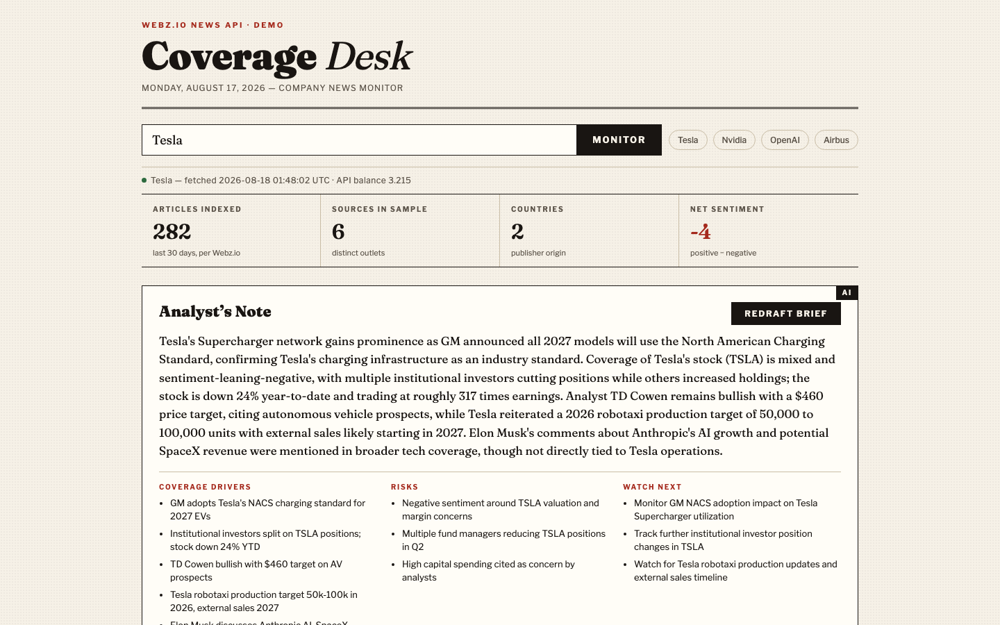
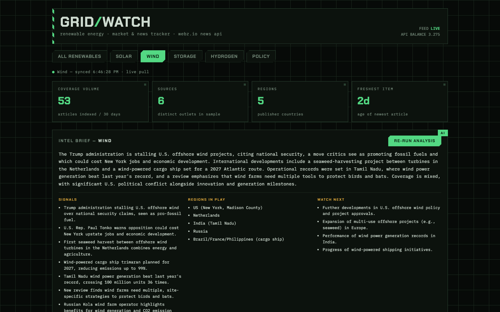

# webz.io demos

Two small, self-contained demos built on the [Webz.io News API](https://webz.io/products/news-api),
showing two different consumption patterns and two different stacks.

| Coverage Desk (Python/Flask) | GRID/WATCH (Node.js) |
|---|---|
|  |  |

Full-page captures: [Coverage Desk](screenshots/coverage-desk.png) · [GRID/WATCH](screenshots/grid-watch.png)

| Demo | Stack | What it shows |
|---|---|---|
| [`company-news-dashboard/`](company-news-dashboard) | Python 3 + Flask + LLM | Company news monitoring: search any company, get sentiment split, top sources, country spread, latest coverage, and an LLM "Analyst's Note" (drivers / risks / watch-next) |
| [`market-tracker/`](market-tracker) | Node.js (zero deps) + LLM | Industry tracker for the renewable-energy market: segmented feeds (solar / wind / storage / hydrogen / policy) with coverage volume, geography, and an LLM "Intel Brief" per segment |

Both demos:

- Call `https://api.webz.io/api/news` server-side — the token never reaches the browser.
- Cache responses in-memory (5–10 min TTL) so browsing the UI doesn't burn API credits.
  Each Webz.io request costs credits (`cost` / `balance` fields in the response), so
  cache-by-default is the right shape for a real deployment too.
- Read the token from a `WEBZ_TOKEN` env var (`.env` supported, never committed).

## Quick start

```bash
# Python dashboard
cd company-news-dashboard
cp .env.example .env        # paste your Webz.io token
pip install -r requirements.txt
python app.py               # → http://localhost:5001

# Node tracker
cd market-tracker
cp .env.example .env        # paste your Webz.io token
node server.js              # → http://localhost:3000  (no npm install needed)
```

Both `.env` files also take an optional `OPENROUTER_API_KEY` for the LLM analysis panels
("Analyst's Note" / "Intel Brief") — one LLM call (`xiaomi/mimo-v2.5` via OpenRouter) over
the already-fetched articles, structured-output JSON, cached 15 min. Without the key,
everything else still works.

## Webz.io API notes

- Endpoint: `GET /api/news` with `q` (boolean query language: quoted phrases, `OR`/`AND`,
  filters like `language:english`, `site_type:news`), `sort`, `size`, `format=json`.
- Pagination: the response's `next` field is a ready-made relative URL for the next page.
- Useful response data beyond the posts themselves: `total_results` (coverage volume for a
  query — used as a market-signal metric in the tracker), per-post `sentiment`, per-entity
  sentiment (`entities.organizations[].sentiment` — used for company-level sentiment in the
  dashboard), `thread.country`, `thread.domain_rank`, and account `balance` / `cost`.
